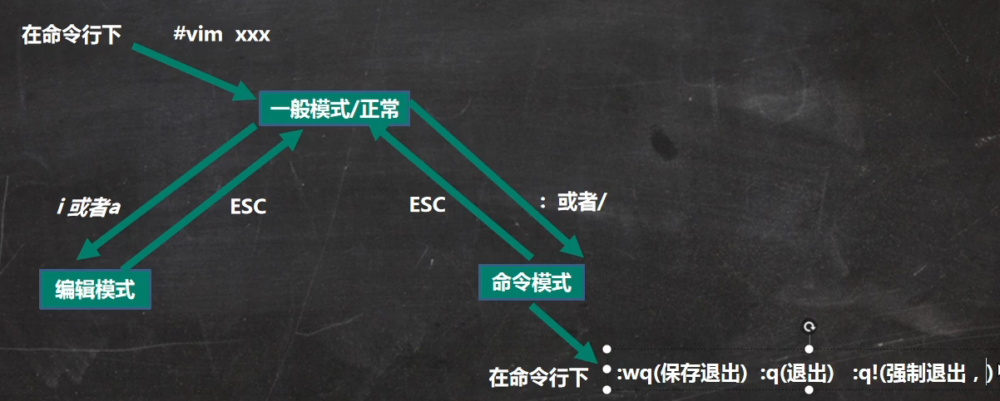
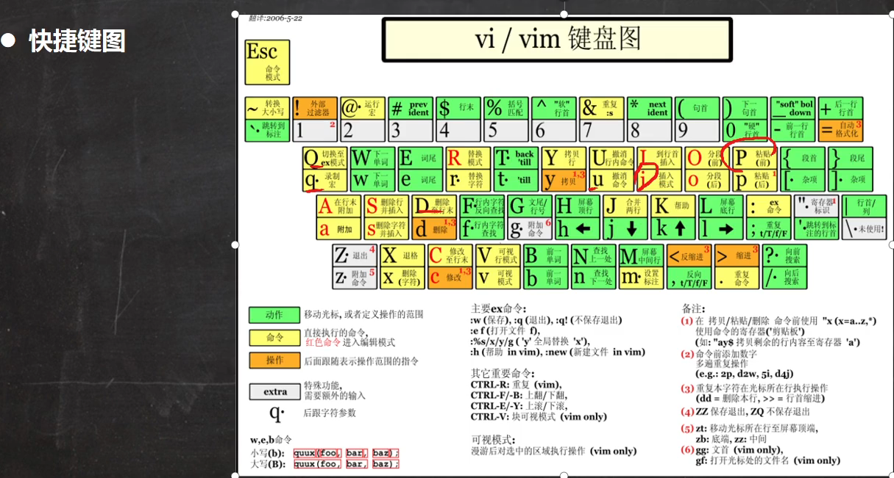

Linux系统中会内置vi文本编辑器

Vim具有程序编辑的能力，可以看成vi的升级版，可以主动的以文字颜色判断语法的正确性，方便程序的设计。代码补全、编译以及错误的跳转等方便编程的功能特别丰富，广泛使用

我们先来了解一下vi和vim常用的三种模式：

- ### 正常模式

  - 以vi或vim打开一个文档就直接进入一般模式了(这是默认的模式)，在这个模式下，你可以使用上下左右键来移动光标，可以使用**删除字符**或 **删除整行**来处理档案内容，也可以使用**复制、粘贴**来处理文件数据

- ### 插入模式

  - 按下i,I,o,O,a,A,r,R等任意一个字符之后就会从正常模式进入插入模式

- ### 命令行模式

  - 如何从插入模式切换到正常模式 先按esc键进入正常模式在输入:q【离开不保存】 :w【保存数据】 :wq【离开并保存】 :q!【强制离开】 :wq!【保存并且强制离开】，然后回车
  - 在这个模式下，可以提供给你相关的指令，完成读取、存盘、替换、离开vim、显示行号等的动作则是在此模式中达成的

## Vi和Vim的快捷键

- 拷贝当前行 yy,拷贝当前行下的n行 nyy,按p从光标位置开始粘贴
- 删除当前行 dd，删除当前行下的n行 ndd
- 在当前文件中查找某一个单词【命令行下/关键字, 回车查找，输入n就是查找下一个】
- 设置文件的行号，取消文件的行号[命令行下:set nu 和:set nonu]
- 定位到文件的最首行【gg】和最末行【G】在一般模式下
- 撤销文件中的编辑行为，在一般模式下按u
- 在一般模式下，使用n+shift+g能够将光标定位到第n行位置

上面整理的是常见的快捷方式，其他命令可看：https://blog.csdn.net/outcast2505/article/details/130978341

