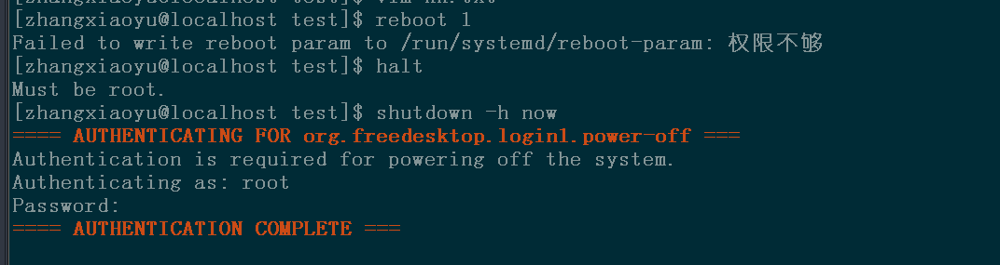
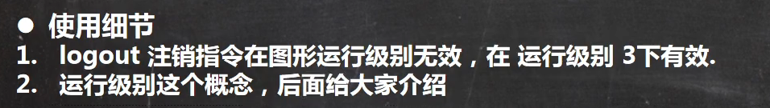

### 关机：

```
shutdown -h now 立刻进行关机
shutdown -h 1 1分钟之后进行关机
halt
sync  把内存的数据同步到磁盘
```

### 重启：

```
shutdown -r now 立即重启电脑
reboot 
```



可以看出关机和重启操作只有root用户才权限

### 用户的登录：

- 用户的登录尽量少用root账号登录，因为它是系统管理员，最大的权限，避免操作失误，可以使用普通用户，如果当前用户root用户可以使用'su - 用户名'命令来进行切换成系统管理员
- 使用logout能够从切换的用户退回到原来用户，如果本来就是原来用户就会退出登录

