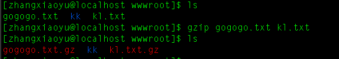

# 压缩和解压

## gzip/gunzip指令

gzip用于压缩文件，gunzip用于解压缩文件

基本语法：

```
gzip 文件  #压缩文件，只能将文件压缩为*.gz文件  #虽然压缩文件可以有多个，用空格隔开，但是需要注意的是一个压缩文件中只存在一个文件
gunzip 文件.gz   #解压缩文件
```



这个命令只是用于压缩文件，不能去压缩文件夹

## zip/unzip指令

zip用于压缩文件或文件夹，unzip用于解压

基本语法：

```
zip [选项]  XXX.zip  将要压缩的内容（压缩文件和目录）   -r:递归压缩，即是压缩目录  #内容可以是多个不同路径的文件或文件夹以空格分开
unzip [选项]  XXX.zip  #解压缩文件    -d<目录>: 指定解压后文件存放目录
```

其中在虚拟中是没有zip和unzip指令的，需要使用yum进行安装：

```
sudo yum install zip
sudo yum install unzip
```

## tar指令

tar即是一个打包指令也是一个解压指令，通过选项进行选择，打包后的文件是.tar.gz的文件

基本语法：

```
tar [选项] XXX.tar.gz 打包内容  #内容可以是多个不同路径的文件或文件夹以空格分开
```

选项说明：

```
-c		产生.tar打包文件
-v		显示详细信息
-f		指定压缩后的文件名
-z		打包同时压缩
-x		解压.tar文件
```

一般压缩的时候选项一般使用 -zcvf 来进行压缩