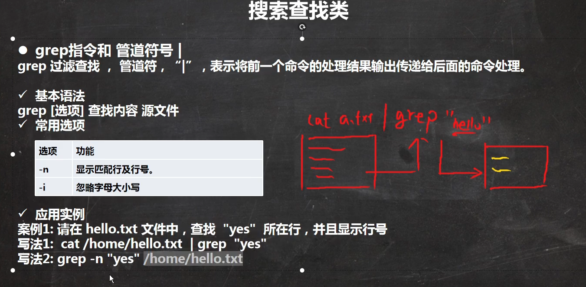

find指令将从指定目录向下递归地遍历其各个子目录，将满足条件的文件和目录显示在终端

基本语法：

```
find [搜索范围] [选项]
```

选项说明  -name 文件名或目录名   功能：按照指定的文件名或目录名查找文件

​				-user  用户名   功能：查找属于指定用户名所有文件

​				-size 文件大小【单位有K/M/G; +n表示大于，-n表示小于，n表示等于】     功能：按照指定的文件大小查找文件

locate指令：

locate指令可以快速定位文件的路径，locate指令利用事先建立的系统中所有文件名称及路径的locate数据库实现快速定位给定的文件。locate指令无需遍历整个文件系统，查询速度较快。为了保证查询结果的准确度，管理员必须定期更新locate时刻

由于locate指令是基于数据库进行查询的，所以第一次运行前，必须使用updatedb指令来创建locate数据库

基本语法：

```
locate 搜索文件
```

问题：

在虚拟机中是没有安装updatedb对应的指令的，此时我们要通过：

```
 yum install mlocate
```

进行安装

问题：bash: apt-get: 未找到命令

看起来您正在尝试在Bash终端中执行"apt-get"命令，但是出现了"未找到命令"的错误消息。这是因为"apt-get"是用于Debian、Ubuntu和类似系统的包管理器命令，而不是所有Linux发行版都支持它。

如果您正在使用基于Debian或Ubuntu的Linux发行版，可能是因为您没有足够的权限或未正确安装包含"apt-get"的软件包。您可以尝试使用sudo来以管理员权限运行apt-get命令，例如：

```
sudo apt-get update
```

如果您正在使用其他Linux发行版，可能会使用不同的包管理器，如yum (用于CentOS/RHEL) 或 dnf (用于Fedora)。在这种情况下，您可以尝试使用适合您发行版的包管理器来执行操作。

例如，对于CentOS/RHEL，您可以使用yum：

```
sudo yum update
```

对于Fedora，您可以使用dnf：

```
sudo dnf update
```

如果您仍然遇到问题，请提供您使用的Linux发行版的名称，我将为您提供更具体的指导。

which指令，可以查看某个指令在哪个目录下，比如搜索ls指令在哪个目录下：

```
which ls
```

