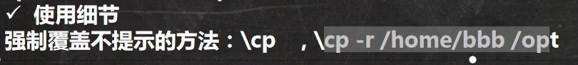

在linux系统下，以“.”开头的是隐藏文件

### 获取当前绝对路径：

```
pwd 
```

### 显示当前目录下的文件和目录：

```
ls [-a|-l] [可以指定目录]   -a:显示当前目录的所有的文件和目录，包括隐藏的；-l:以列表的方式显示信息
```

### 切换目录：

```
cd [~|..|具体目录绝对地址或相对地址]  ~:返回到当前用户的家目录 ...:回到当前目录的上级目录
```

### 创建文目录：

```
mkdir [选项(-p)] 要创建的目录    -p:多级目录
```


### 删除目录:

```
rmdir [选项] 要要删除的目录    只能删除空目录，要删除非空目录就需要使用rm命令
```

### 创建文件：

```
vim|vi 文件名  进入编辑，编辑完后退出即可创建一个文件
touch 文件名  直接创建一个空文件
```


### 删除文件：

``` 
rm [选项(-r|-f)] 文件或目录  -r:递归删除整个文件夹，-f:强制删除不提示 	
```

### 拷贝文件：

```
cp [选项(-r)] source dest  -r:递归复制整个文件夹  source:要被拷贝的文件 dest:要拷贝到的目录
```





### 移动文件与目录或重命名：

```
mv oldNameFile newNameFile  重命名
```


```
mv /temp/movefile /targetFolder  移动文件
```


### 查看文件内容：

之前的vim或vi是可以查看文件的，但是会有危险，因为他们是可编辑的，下面这个指令是只有读的权限的

```
cat [选项(-n)] 要查看的文件  -n:显示行号
```


### echo输出内容到控制台：

```
echo [选项] [输出的内容] 一般使用echo来输出环境变量  echo $PATH 
```

### 显示文件的开头部分的内容（默认显示前十行）：

```
head 文件    head -n 5 文件 查看文件前5行内容
```

### 显示文件的结尾部分的内容（默认显示末尾前十行）：

```
tail 文件    tail -n 5 文件 查看文件末尾前5行内容  tail -f 文件  实时追踪该文档的所有更新
```


### 		history是查看已经执行过的历史命令，也可以执行历史命令


