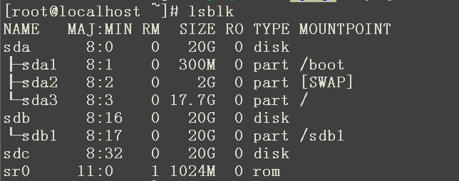
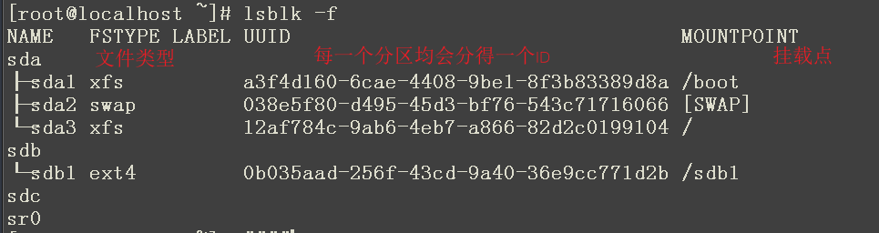
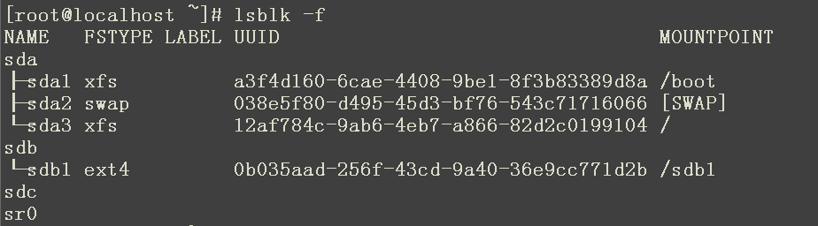
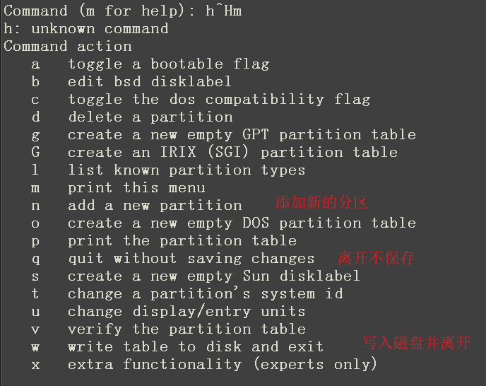
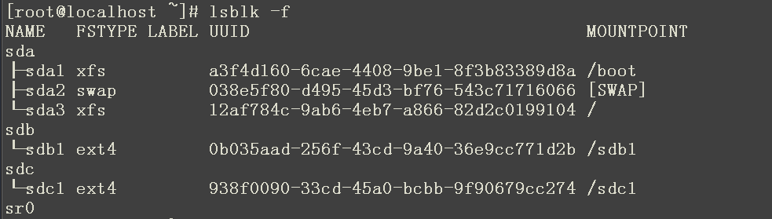
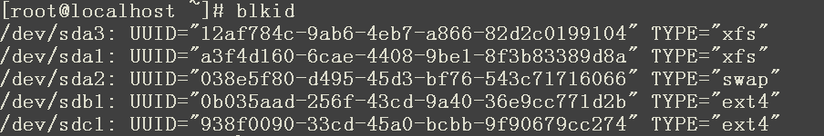
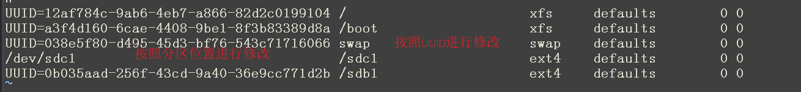
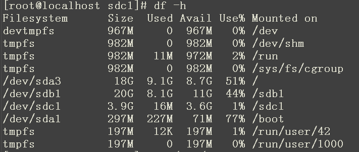
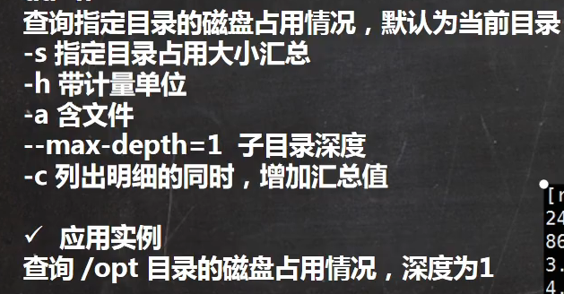
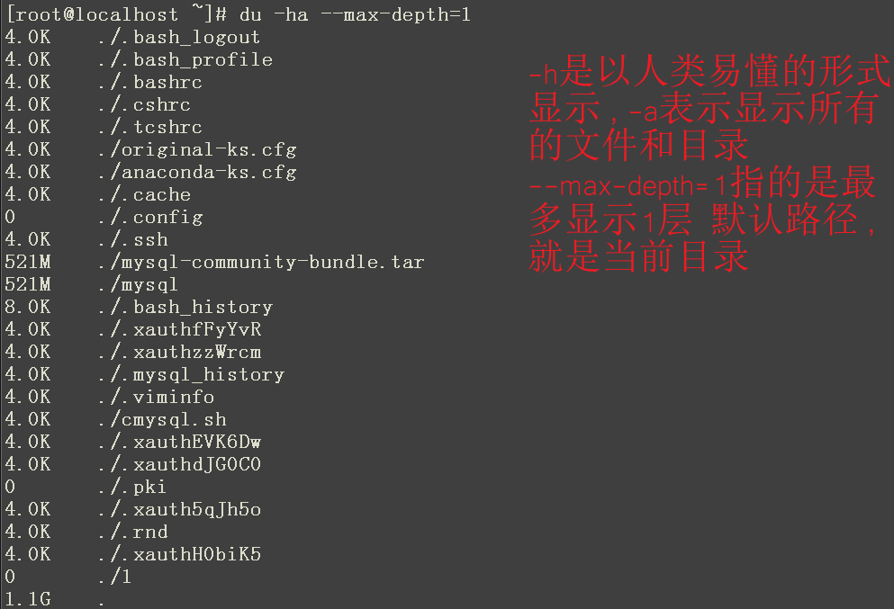

查看所有分区挂载情况的命令：

###### 1、lsblk






分区挂载的几个步骤：

#### 1、 lsblk -f



可以看到一个sdc磁盘并未分区

#### 2、fdisk  /dev/sdc

进行分区 ，具体的指令如下：



#### 3、mkfs -t ext4 /dev/sdc1 对分区进行一个格式化


#### 5、mount /dev/sdc1 /sdc1/  创建一个目录将分区挂载上去


#### 6、 umount /sdc1  进行卸载


重启后挂载命令会失效，虽然磁盘文件不会丢失，但是需要去找到这些文件，就还需要执行一遍挂载操作，要实现永久挂载，就需要修改 /etc/fstab 文件来实现，修改完成之后只需要使用mount -a即刻生效

1、使用磁盘分区的UUID进行更改

​		获取磁盘分区的两个命令：   

​			1、lsblk -f 

​					

​		    2、blkid



2、可以使用磁盘分区位置来进行更改



查询系统整体磁盘使用情况：

#### 1、df -h




查询指定目录的磁盘占用情况：

基本语法：

du -h






### 磁盘情况-工作常用指令

1. 统计一个文件夹下的文件的个数

   ```
   ll | grep "^-" | wc -l
   ```

2. 统计一个文件夹下的目录的个数

   ```
   ll | grep "^d" | wc -l
   ```

3. 统计一个文件夹下的文件个数，包括子文件夹中的文件

   ```
    ll -R | grep "^-" | wc -l
   ```

4. 统计一个文件夹下的目录，包括子文件夹里面的

   ```
   ll -R | grep "^d" | wc -l
   ```

5. 以树状显示目录结构

   ```
   tree 目录
   ```

   tree需要进行安装 yum  install  tree

   

