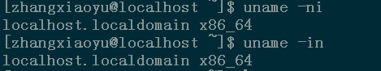

## 2.1 Linux(UNIX)命令的格式

Linux(UNIX)命令的语法格式如下：

```kotlin
命令  【选项】 【参数】 （command [options] [arguments]）
```

命令行中的每一项之间使用一个或多个空格分隔开。在命令行中每个部分的具体含义如下：

- 命令：告诉Linux（UNIX）操作系统做（执行）什么
- 选项：说明命令运行的方式（可以改变命令的功能）。选项部分是以“-”字符开始的
- 参数：说明命令影响（操作）的什么（如一个文件、一个目录或一段正文文字）

## 2.2 whoami命令


whoami命令的功能就是列出您目前登录的Liunx系统所使用的用户名（账户）


who am i 命令同样也会得到所需的信息而且更多，包括用户名、显示登录的终端（pts/0）、当前的日期和时间以及所使用的计算机的IP地址（192.168.80.1）

对于绝大多数Linux（UNIX）命令，如果在命令的单词之间加入空格或标点符号，该命令会照常执行

## 2.3 who、w、users和tty命令


who命令获取当前哪些用户在系统上工作


w命令与who命令类似，但是信息比who命令多一些，下面我分析一下每一行从左至右的含义

第一行：当前时间是10:45:55、系统已经启动（up）了21min、目前有1个用户登录、系统在过去1min内平均提交0.00个任务（或启动程序）、在过去的10min内平均提交0.01个任务、在过去的15min内平均提交0.06个任务（load average为平均负载，之后的3个数字分别表示过去1min内的负载、过去10min内的负载和过去15min内的负载）

LOGIN@表示的是用户的登录系统时间，IDLE表示zhang用户是一个正在活动的用户(IDLE为3.00s最后一次激活控制台以来已经过去了3.00s)，JCPU表示到目前为止用户一共使用了多长的CPU时间，PCPU表示当前用户在当前运行的程序使用了多长的CPU时间，WHAT表示用户当前所运行的程序


若你只想知道目前有哪些用户登录了Linux系统，就可以使用users命令


想要知道目前登录Linux系统所使用的终端，就使用tty

想要详细了解tty与终端的可以看：

[[Linux 终端(TTY) - 墨尔基阿德斯 - 博客园 (cnblogs.com)](https://www.cnblogs.com/peifx/p/16455856.html)](https://www.cnblogs.com/peifx/p/16455856.html)

## 2.4 uname命令及带有选项的命令


如果想知道登录系统的信息使用uname命令（UNIX name的缩写）

我们使用--help选项来获取uname命令所有的选项：


下面我们将一一来介绍这些选项，并且介绍如何将选项叠加

-n 表示网络节点上的主机名，也就是当前使用系统的主机名


-i 表示输出当前硬件平台名


什么硬件平台这个应该在计组中有，

如何既显示系统用户名又显示硬件平台名



以上可以看出命令显示的结果与选项的先后顺序无关

## 2.5 date、cal和clear命令及带来有参的命令

date命令显示系统当前的日期和时间


cal(为calendar的前3个字符)命令用来显示某月的日历


可以指定某一年，某一月


第一个参数是要显示的月份，第二个参数为要显示的年份

也可以只写年份，会显示这一年的所有日历

clear命令是清屏

## 2.6 su和passwd命令

su（switch user的缩写）用于用户的切换，在使用telnet进行远程登录，是不能够使用root用户的，只能通过使用普通用户进行登录，然后再进行用户的切换

```
su - 切换到的用户名
```


其中root可以不用写默认也是root用户


如果当前用户是root，那么可以使用exit退回到普通用户


su命令不但可以从普通用户切换到root用--户，还可以从一个普通用户切换到另一个普通用户，也可以从root用户切换到一个普通用户

passwd（password的缩写），可以使用passwd命令来更改所有用户的密码，查看密码状态等


可以看出，root进行更高密码时，不会进行旧密码的验证，也不会进行其他，比如密码相近或密码过短，因为root用户有至高无上的权利

root用户可以更改其他用户的密码，但是其他用户不能更高root用户的密码：

```
passwd 用户名
```

不会进行旧密码的验证，也不会进行其他，比如密码相近或密码过短

passwd命令的另一个功能就是查看某一用户密码的转态，这是通过在命令中使用-S选项来完成的，不过只有root用户才能使用


使用useradd命令可以添加用户

passwd命令中使用--status选项，该选项的功能与-S相同

## 2.7 whatis命令与命令的--help选项

由于UNIX或Linux操作系统的命令中的选项及参数实在是太多，不能去全部记忆下来，此时我们就需要用到系统给我们的多种帮助工具

whatis命令显示所查询命令的简单说明：

```
whatis 查询命令名
```


--help选项也是获取帮助信息的，该选项可以用于绝大多数Linux的命令，但不是所有命令

### man获取帮助信息

基本语法：

```
man [命令或配置文件] #获取帮助信息
```


***Linux 中的命令 "whoami "和 "who am i "都用于检索用户信息，但它们的用途略有不同。***

***"whoami"：***
***whoami "命令是一个简单明了的命令，用于显示当前用户的用户名。在终端运行 "whoami "时，它会显示当前登录并执行命令的用户名。例如，如果登录的用户是 "john"，运行 "whoami "命令的输出将显示 "john"。***

***"我是谁***
***who am i "命令也显示用户信息，但它特别显示启动会话的原始用户。当当前用户使用 "su"（替代用户）命令切换到另一个用户时，该命令非常有用。如果用户 "john "远程登录，然后使用 "su - root "切换到根用户，运行 "who am i "将显示 "john "作为输出，表明会话是由用户 "john "发起的。***

***总之，这两条命令的主要区别在于，当用户使用 "su "命令切换到另一个用户后，使用这两条命令的行为不同。"whoami "总是显示当前用户的名称，而 "who am i "则显示启动会话的原始用户，即使用户已经切换。***
