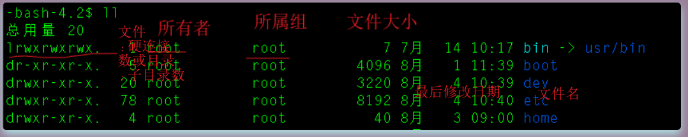

在liunx中的每一个用户必须属于一个组，不能独立于组外。在Linux中每个文件有所有者、所在组、其他组的概念

- 所有者

  一般为文件的创建者，但是后面可以修改所有者

  - 查看文件的所有者

    ```
    ls -ahl   -a:all表示全部文件，包括隐藏文件 -h:human 与-l 一起，以易于阅读的格式输出文件大小(例如 1K 234M 2G)  -l使用较长格式列出信息
    或者使用
    ls -ah   
    ```

  - 修改文件所有者

    ```
    chown -R 用户名 文件名    #chown:change own [改变个人的]   -R表示递归，如果需要修改的是文件夹，如果不是-R就只会将最外层的权限进行更改，它的子文件和子目录是不会被修改的
    ```

    

- 组

  组的创建

  ```
  groupadd 组名 
  ```

  

  下面来创建一个用户并将用户添加到新增的组

  ```
  groupadd monster
  useradd -g monster fox
  ```

  

  修改文件的所在组
  
  ```
  chgrp 组名 文件名    #chgrp: change group 改变组
  ```
  
  


​	其他组：

​		除文件的所有者和所在组的用户外，系统的其他用户都是文件的其他组

​	改变用户所在的组：	

```
usermod -g 组名 用户名
usermod -d 目录名 用户名   #改变用于登录的初始目录，但是注意用户需要有进入到目录的权限
```


​	权限的基本介绍

​	



​	第一列就是文件类型、所有者所属组和其他组的权限

​	这个一串字符（总共10位）的第一个字符表示的是文件代表的类型，文件类型对应的字符如下：

```
l 代表的是链接，相当于windows的快捷方式
d 代表的是文件目录
- 代表的是普通文件
c 代表字符设备文件，鼠标，键盘
b 代表块设备，比如硬盘
```

第1~3 表示的是所有者的权限  rwx

第4~6 表示的是所属组的权限  rwx

第7~10 表示的是其他组的权限  rwx

```
r:可读取权限  #作用在文件可以读取，查看 作用在目录可以读取，ls查看目录内容
w:可写权限  #作用在文件可以修改，但是不代表可以删除该文件，删除一个文件的前提条件是对该文件所在目录有写权限，才能删除该文件，作用在目录可以修改，对目录内创建+删除+重命名目录
x:可执行权限  #作用在文件可以执行，作用在目录表示可以进入该目录
```

可用数字表示为：r=4,w=2,x=1 因此rwx=4+2+1=7

```
x:1
w:2
wx:3
r:4
rx:5
rw:6
rwx:7
```


修改权限-chmod  (mod:*vt.*修改，改进)

​		通过chmod指令，可以修改文件或者目录的权限

​		第一种方式：+、-、=来变更权限

```
chmod u=rwx g=rwx o=x  文件名/目录名  #u表示所有者 ，g表示所属组，o表示其他组
chmod g-x-w 文件名/目录名
chmod o+r+w 文件名/目录名
```

进行权限的修改只能是文件的所有者或root用户

​		第二种方式就是通过权限对应的数字进行更改权限

```
chmod u=rwx g=rwx o=x  文件名/目录名
类比于
chmod 771 文件名/目录名
```

